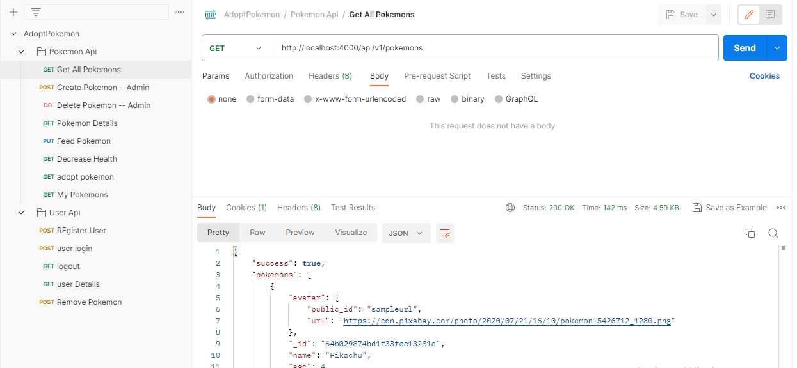
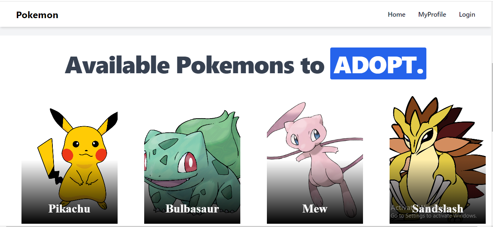
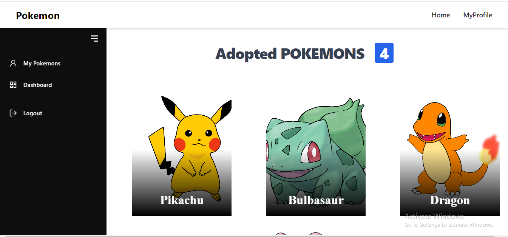
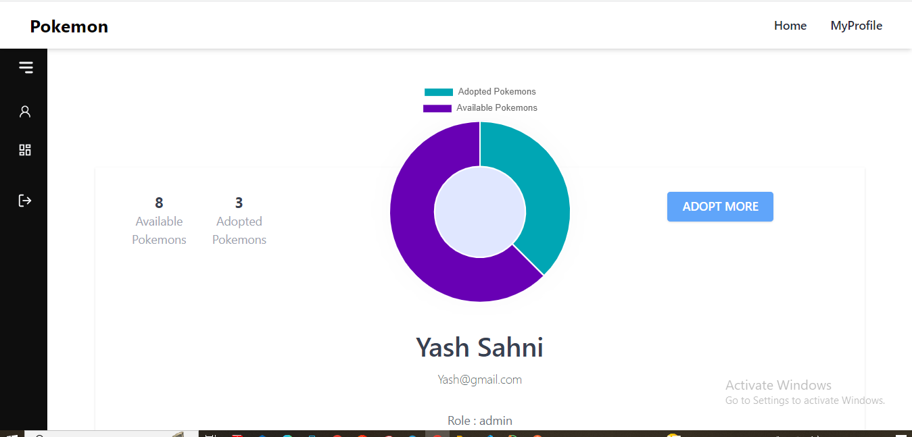
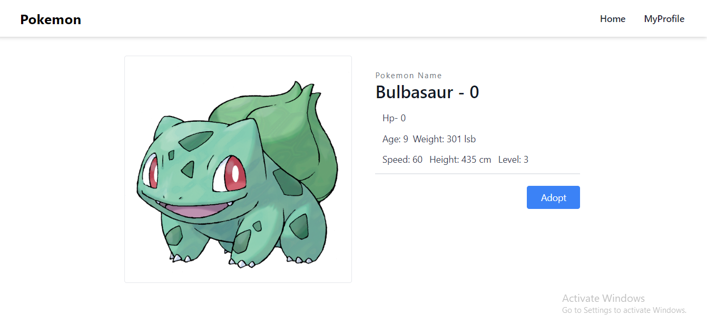
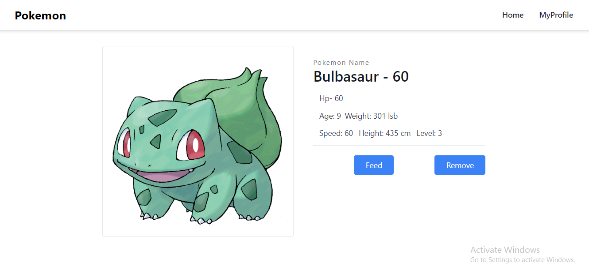

# Hyathi Technologies Full Stack Development Task - Virtual Pokemon Adoption App

## Task

The app will allow users to:

- Register and log in.
- View available Pokemon for adoption (each Pokemon has different attributes like breed, age, health status, etc.).
- Adopt a Pokemon (Each user can adopt multiple Pokemon, but each Pokemon can be adopted only once).
- Once a Pokemon is adopted, the user can feed the Pokemon (each feeding increases Pokemon's health status).
- If a Pokemon isn't fed for a certain time (ex: 24 hours), its health status decreases.

## Tech Stack

- Backend: Node.js, Express, and MongoDB
- Frontend: React

## Project Structure

## project structure

```terminal
backend
frontend
.gitignore
LICENSE
README.md
```

## How to use Online.

- Frontend - (https://hyathi-fullstack-yashtask.vercel.app/)

- Backend - (https://hyathi-fullstack-task-allapi.vercel.app/)

## Api Included

- Register

- Login

  Admin Credentials => Email - "Yash@gmail.com" Password - "passwordYash"

  User Credentials => Email - "Joey@gmail.com" Password - "passwordJoey"

- Logout

- User Details

- All Pokemons

- My Pokemons

- Pokemon Details

- Adopt Pokemon

- Remove Pokemon

- Feed Pokemon

- Create Pokemon -- Admin

- Delete Pokemon -- Admin



## Screen Shots of working project.

Home Page



Profile Page



Dasboard



Product Detail




